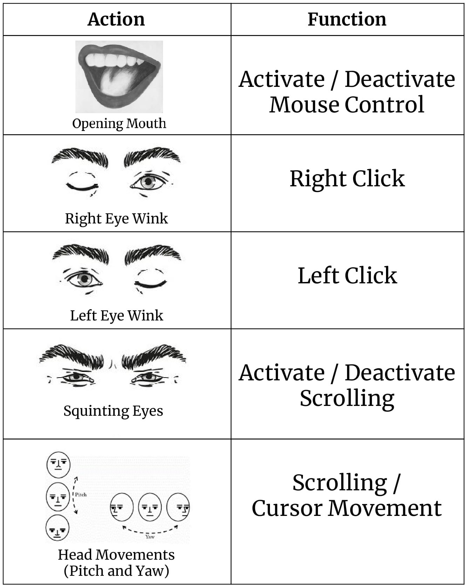
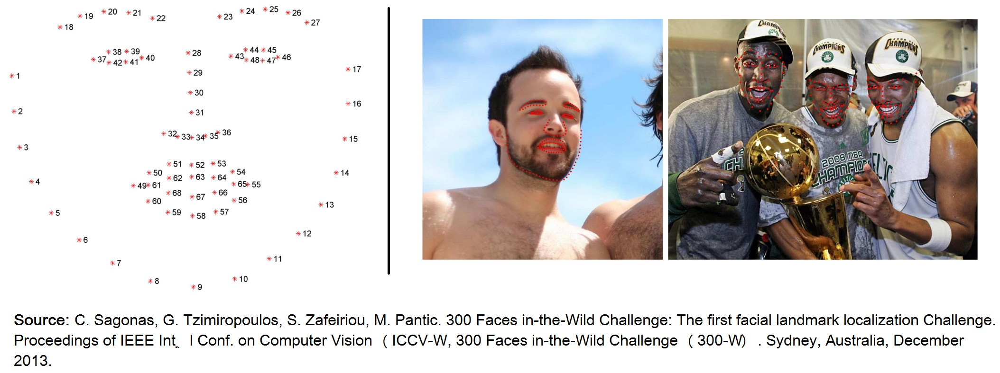
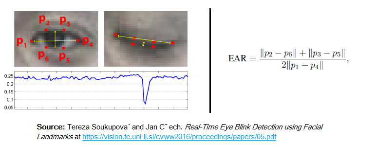

# Mouse Cursor Control Using Facial Movements

This HCI (Human-Computer Interaction) application in Python(3.6) will allow you to control your mouse cursor with your facial movements, works with just your regular webcam. Its hands-free, no wearable hardware or sensors needed.

At this point, you are forced to work with the facial movements I chose but I am working on making them configurable. The list of actions include:

 - Squinting your eyes (**squint** _(v.)_ - To look with the eyes partly closed, as in bright sunlight)
 - Winking
 - Moving your head around (pitch and yaw)
 - Opening your mouth (a little bit, yes)

## Code Requirements
* Numpy - 1.13.3
* OpenCV - 3.2.0
* PyAutoGUI - 0.9.36
* Dlib - 19.4.0
* Imutils - 0.4.6

Please raise an issue in case of any errors. 

## Usage
 
I definitely understand that these facial movements could be a little bit weird to do, especially when you are around people. Being a patient of [benign-positional-vertigo](https://www.healthline.com/health/benign-positional-vertigo), I hate doing some of these actions myself. But I hope to make them easier and less weird over time. Feel free to suggest some public friendly actions that I can incorporate in the project. 

## How It Works
This project is deeply centered around predicting the facial landmarks of a given face. We can accomplish a lot of things using these landmarks. From detecting eye-blinks [[3](#references)] in a video to predicting emotions of the subject. The applications, outcomes and possibilities of facial landmarks are immense and intriguing.

[Dlib](dlib.net/)'s prebuilt model, which is essentially an implementation of [[4](#references)], not only does a fast face-detection but also allows us to accurately predict 68 2D facial landmarks. Very handy.  

Using these predicted landmarks of the face, we can build appropriate features that will further allow us to detect certain actions, like using the eye-aspect-ratio (more on this below) to detect a blink or a wink, using the mouth-aspect-ratio to detect a yawn etc or maybe even a pout. In this project, these actions are programmed as triggers to control the mouse cursor. [PyAutoGUI](http://pyautogui.readthedocs.io) library was used to control the mouse cursor. 

### Eye-Aspect-Ratio (EAR)
You will see that Eye-Aspect-Ratio [[1](#references)] is the simplest and the most elegant feature that takes good advantage of the facial landmarks. EAR helps us in detecting blinks [[3](#references)] and winks etc.  

You can see that the EAR value drops whenever the eye closes. We can train a simple classifier to detect the drop. However, a normal if condition works just fine. Something like this:

    if EAR <= SOME_THRESHOLD:
       EYE_STATUS = 'CLOSE'
    
### Mouth-Aspect-Ratio (MAR)
Highly inspired by the EAR feature, I tweaked the formula a little bit to get a metric that can detect open/closed mouth. Unoriginal but it works.  

Similar to EAR, MAR value goes up when the mouth opens. Similar intuitions hold true for this metric as well. 

